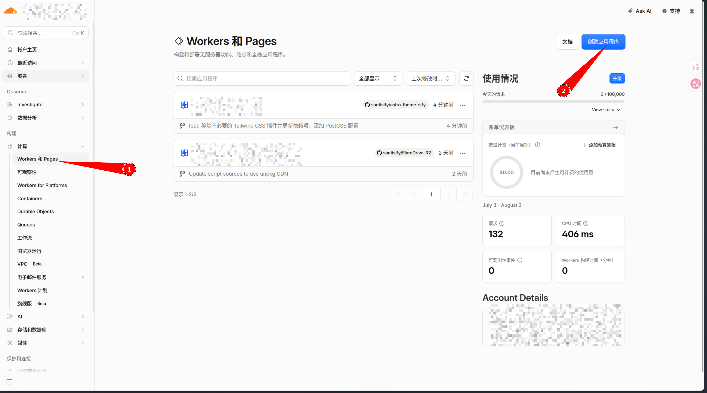
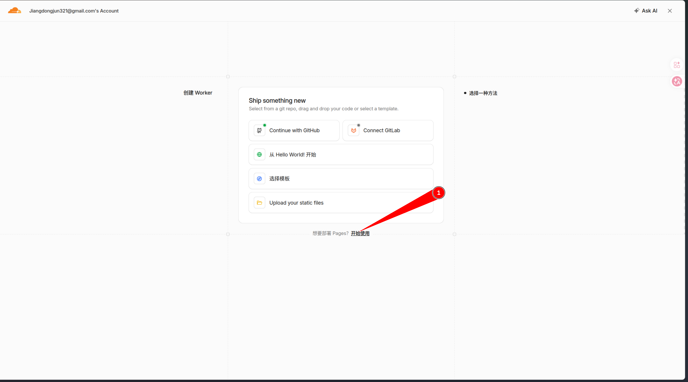
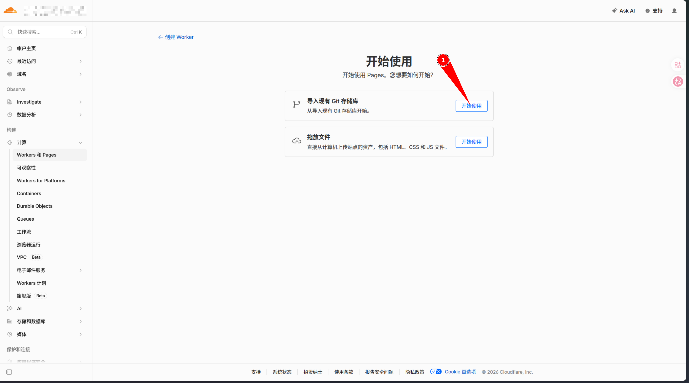
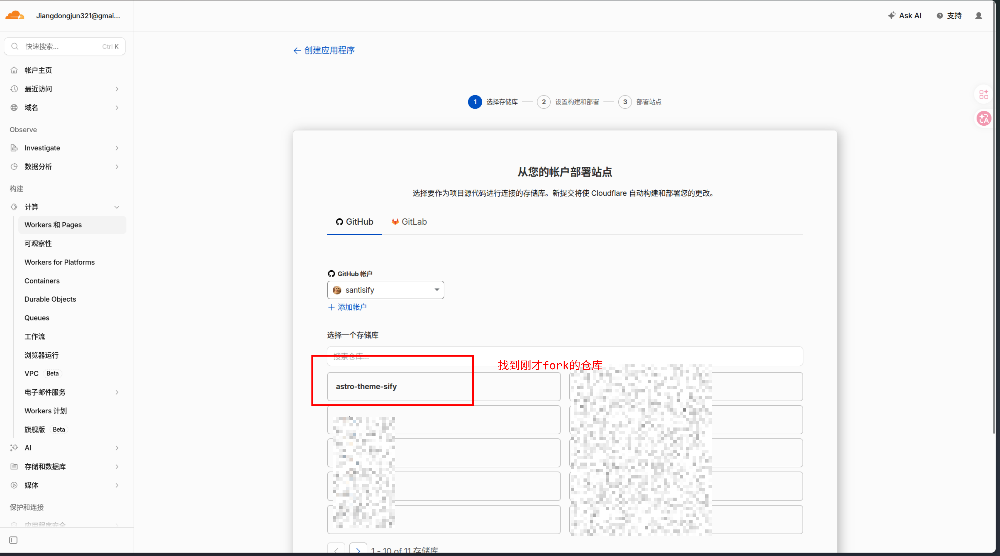
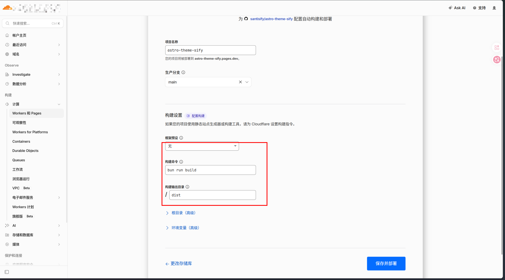

> Live Demo: [astro-sify-demo.lazy-boy-acmer.cn](https://astro-sify-demo.lazy-boy-acmer.cn/) | GitHub: [santisify/astro-theme-sify](https://github.com/santisify/astro-theme-sify)

## Prerequisites

Make sure you have **Bun** (recommended) or **Node.js 18+** installed.

```bash
# Install Bun
curl -fsSL https://bun.sh/install | bash
```

## Create the Project

```bash
# Clone the repository
git clone https://github.com/santisify/astro-theme-sify.git my-blog
cd my-blog
bun install # If you're using Node.js, run: npm install
```

### Common Commands

```bash
# Bun
bun dev          # Start the development server (localhost:4321)
bun run build    # Build the production version
bun preview      # Preview the production build

# npm
npm run dev
npm run build
npm run preview
```

## Configure the Site

Edit `src/consts.ts` and update your site's basic information:

```typescript
export const SITE_TITLE = 'My Blog';
export const SITE_DESCRIPTION = 'This is my personal blog';
export const SITE_AUTHOR = 'Your Name';
export const SITE_URL = 'https://example.com';
export const SITE_AVATAR = '/avatar.png';
export const SITE_COVER = '/cover.jpg';
export const PAGE_SIZE = 10;
```

### Navigation Menu

```typescript
export const NAV_ITEMS = [
  { label: 'Home', href: '/' },
  { label: 'Weekly', href: '/weekly' },
  { label: 'Articles', href: '/archives' },
  { label: 'Friends', href: '/friends' },
  { label: 'About', href: '/about' },
];
```

### Social Links

```typescript
export const SOCIAL_LINKS = [
  { name: 'GitHub', href: 'https://github.com/yourname', icon: 'github' },
  { name: 'RSS', href: '/rss.xml', icon: 'rss' },
];
```

## Writing Posts

Create `.md` or `.mdx` files inside the `src/content/blog/` directory.

### Frontmatter Fields

```yaml
---
title: Post Title                     # Required
description: Post description         # Optional
date: 2024-06-01                      # Required
tags: [Tag1, Tag2]                    # Optional (default: [])
category: Tutorial                    # Optional
cover: https://example.com/cover.jpg  # Optional (remote URL or local path)
series: Series Name                   # Optional (groups related posts automatically)
pinned: false                         # Pin this post to the top
draft: false                          # Exclude from production build if true
---
```

### Post Organization

Two directory structures are supported:

```text
src/content/blog/
├── my-post.md              # Single-file format
└── my-post/
    ├── index.md            # Folder format (recommended for local images)
    ├── cover.webp          # Cover image
    └── images/             # Images used in the article
```

### Local Images

Reference local images using relative paths:

```yaml
cover: ./cover.webp
```

Image paths are automatically resolved through `src/pages/_imageStore.ts`.

## Configure Comments

Edit `src/components/waline/Comment.astro` and set your Waline server URL:

```typescript
const serverURL = 'https://your-waline-server.vercel.app';
```

## Configure Friend Links

Edit `public/links.json` and add your friends' websites:

```json
{
  "friends": [
    {
      "id_name": "cf-links",
      "data": [
        {
          "name": "Friend Name",
          "avatar": "https://example.com/avatar.png",
          "desc": "Short description",
          "link": "https://example.com"
        }
      ]
    }
  ]
}
```

## Deployment

### Vercel

[](https://vercel.com/new/import?hasTrialAvailable=1&id=1253285029&name=astro-theme-sify&owner=santisify&provider=github&remainingProjects=1&s=https%3A%2F%2Fgithub.com%2Fsantisify%2Fastro-theme-sify&teamSlug=santisify&totalProjects=1)

Deploy with a single click—no additional configuration required.

### Cloudflare Pages

First, fork the repository to your own GitHub account.











### Other Static Hosting Services

Run the following command locally:

```bash
bun install && bun run build
```

After the build completes, upload the contents of the `dist/` directory to any static web hosting service.

## Customize the Theme

Edit the CSS variables in `src/styles/global.css` to customize the color scheme:

```css
@theme {
  --color-primary: #e9536a;       /* Primary color */
  --color-bg-light: #f5f5f5;      /* Light background */
  --color-bg-dark: #1a1a2e;       /* Dark background */
  --color-card-light: #ffffff;    /* Light card background */
  --color-card-dark: #1e2a45;     /* Dark card background */
}
```

To change the site's fonts:

```css
--font-family-sans: 'Inter', 'Noto Sans SC', sans-serif;
--font-family-mono: 'JetBrains Mono', 'Fira Code', monospace;
```
