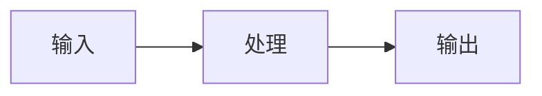

## 暗色模式

点击 Header 右侧的太阳/月亮图标切换亮色/暗色模式。

- 自动跟随系统偏好设置
- 手动选择会存储到 `localStorage`
- 页面加载前即应用主题，无闪烁
- 所有组件均适配两种模式

实现原理：通过 `<html>` 元素的 `.dark` class 控制，配合 CSS 变量切换配色：

```css
:root {
  --color-bg: #f5f5f5;
  --color-text: #2c3e50;
}

:root.dark {
  --color-bg: #1a1a2e;
  --color-text: #e8e8e8;
}
```

## 全站搜索

`Ctrl+K` 或点击搜索图标打开搜索面板。

- 搜索标题、描述、分类、标签和文章正文
- 多关键词 AND 匹配
- 匹配词高亮显示
- 显示上下文摘要片段
- 最多返回 20 条结果

## 文章目录

桌面端文章页右侧显示自动生成的目录导航（基于 h2/h3 标题）。

- 滚动时自动高亮当前阅读位置
- 点击平滑滚动到对应章节
- 移动端通过底部「目录」按钮打开抽屉，支持 ESC 关闭

## 阅读进度

文章页顶部显示一条细进度条，随阅读进度填充，让你清楚知道读到了哪里。

## 分享按钮

文章底部提供多种分享方式：

| 方式 | 说明 |
|------|------|
| Twitter/X | 一键分享到 Twitter |
| 微信 | 桌面端悬停显示二维码，移动端点击切换 |
| 复制链接 | 一键复制文章链接 |
| 原生分享 | 移动端调用系统分享面板 |

## 文章系列

通过 frontmatter 的 `series` 字段将相关文章归为一组：

```yaml
---
series: Astro 教程
---
```

同系列文章在侧边栏自动显示系列列表，当前文章高亮标注。

## 评论系统

使用 Waline 评论系统，支持：

- 昵称 / 邮箱 / 网址
- Markdown 语法
- 暗色模式自动适配
- 需在 `src/components/waline/Comment.astro` 配置服务端地址

## 友链管理

编辑 `public/links.json` 添加好友链接。友链页支持：

- 好友卡片展示（头像、名称、简介）
- 健康检测（自动检测链接可达性，绿/红状态指示）
- 友链圈动态（需配置 `friendCircleServer`）
- 特别推荐区块

## i18n 国际化

点击 Header 右侧的「中/EN」按钮切换语言。

- 支持中文和英文
- 导航栏、页脚等 UI 文本自动翻译
- 存储在 `localStorage.locale`
- 翻译文件位于 `src/i18n/zh.ts` 和 `src/i18n/en.ts`

## 代码块增强

所有代码块自动获得：

- **语言标签**：左上角显示语言名称
- **一键复制**：右上角复制按钮，点击后显示 ✓
- **行号**：左侧显示行号
- **双主题**：亮色/暗色模式自动切换配色

## Mermaid 图表

使用 ` ```mermaid ` 代码块即可在文章中插入图表：

````markdown

````

支持流程图、序列图、类图、甘特图、饼图、状态图、ER 图等。自动适配暗色模式。

## RSS 订阅

自动生成 `/rss.xml`，包含全部已发布文章。订阅链接在 Header 社交图标和页面 `<head>` 中。

## SEO 优化

每页自动注入完整的 SEO 元数据：

| Meta 标签 | 来源 |
|-----------|------|
| `<title>` | `frontmatter.title + 站点名` |
| `<meta description>` | `frontmatter.description` |
| `og:title / og:image` | 文章标题 / 封面图 |
| `twitter:card` | `summary_large_image` |
| JSON-LD | 结构化数据（Article / WebPage） |

## PWA 支持

博客支持作为 PWA 安装到桌面/手机：

- Service Worker 缓存静态资源
- 离线访问已缓存页面
- 可添加到主屏幕

## 回到顶部

滚动超过 300px 后，右下角出现回到顶部按钮，点击平滑滚动回顶部。
